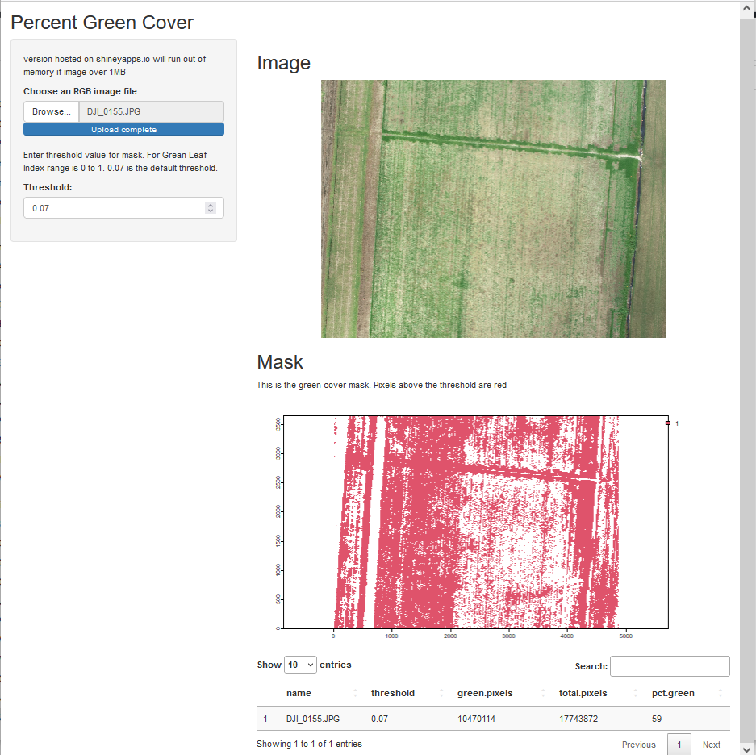

# percent_green

This app evaluates percent green cover in an image. The app converts the RGB image to an index 'Green Leaf Index' (GLI). The user sets a threshold for acceptable green color. The app returns an image of the mask and the count of masked and unmasked pixels and % green.

web app:
https://casapp.shinyapps.io/percent_green/

 
